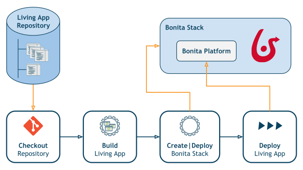

# Bonita Continuous Delivery Add-on

::: info
Welcome to **Bonita Continuous Delivery** documentation website!
:::

The Bonita Continuous Delivery (BCD) add-on provides a solution to use _Continuous Delivery_ practice for your Bonita Living Application development and deployment.

It is composed of two parts:

*   First, a framework for **Continuous Integration** of Living Applications.  
    BCD lets you build a Living Application repository and deploy the generated artifacts from the command line. Besides, a pre-configured standalone [Jenkins CI](https://jenkins.io/) environment is also provided with BCD.
*   Second, a solution for **Provisioning** of Bonita stacks on cloud or on-premises hosts.  
    BCD lets you deploy Bonita on existing servers using [Docker](https://www.docker.com/what-container) containers. Furthermore, when used with the [Amazon Web Services (AWS) cloud platform](https://aws.amazon.com/), BCD enables you to create and delete [AWS EC2 instances](https://aws.amazon.com/ec2/) automatically.

Highlights

Find out what’s new in Bonita Continuous Delivery add-on! Read the release notes.

* [:fa-angle-double-right: What's new in BCD?](release_notes.md)
<!--{ul:.menu .nav}-->

Getting started

Follow this guide with step-by-step instructions to start using Bonita Continuous Delivery solution.

* [:fa-angle-double-right: Getting started with BCD](getting_started.md)
<!--{ul:.menu .nav}-->

Howtos

Check out the tutorials for practical guides about using Bonita Continuous Delivery add-on.

* [:fa-angle-double-right: BCD Howtos](_howtos.md)
<!--{ul:.menu .nav}-->

Basic concepts <!--{.h2}-->

This add-on provides a `bcd` command-line interface (BCD CLI) which enables to:

*  Build and deploy Bonita Living Applications
*  Deploy a full Bonita stack - A **Bonita stack** is formed by a database service, Bonita Docker containers running Tomcat application servers and a HAProxy load balancer when deploying a multi-node Bonita cluster.

The BCD CLI is provided within a ready-to-use environment called **BCD Controller**. This environment is packaged as a Docker image.  
Then a controller container will have to be started interactively on your control host from which `bcd` commands will be issued.

::: warning
It is highly recommended to have a clear understanding of [Docker essential concepts](https://docs.docker.com/engine/docker-overview/) prior to reading this documentation.
:::

