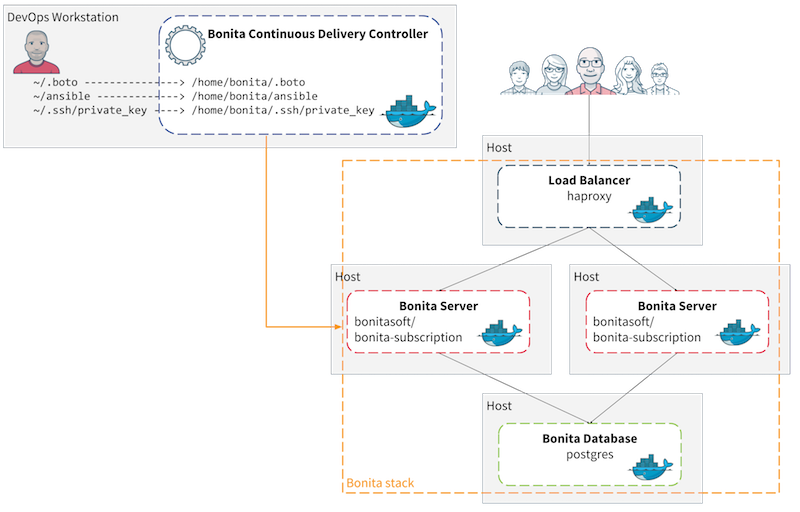

# Bonita Continuous Delivery Add-on


This add-on provides a solution to use _Continuous Delivery_ practice for your Bonita Living Application development and deployment.
It is composed of two main parts:
* First a solution for Bonita stack provisioning on Cloud or on-premise.  
* Second a framework for continuous integration of Living Application. _This CI framework will be delivered in future versions of the add-on._

This documentation focus on the first part: the solution and tooling for provisioning of a Bonita stack.
The tool is composed of a set of scripts to deploy a full Bonita stack automatically (database and Bonita Tomcat application server).

This toolkit is compatible with Amazon EC2 cloud platform (AWS), on premises servers and local virtual machines via [Vagrant](https://www.vagrantup.com/).

These scripts are powered by [Ansible](http://www.ansible.com). Short note from Wikipedia:

::: info
Ansible is a free software platform for configuring and managing computers. It combines multi-node software deployment, ad hoc task execution, and configuration management. It manages nodes over SSH or PowerShell and requires Python (2.4 or later) to be installed on them. Modules work over JSON and standard output and can be written in any programming language. The system uses YAML to express reusable descriptions of systems.
:::

The Bonita Continuous Delivery (BCD) tooling is provided through a Docker container called _BCD Controller_. In this controller you’ll find all useful tooling to manage your provisioning of Bonita platform and more. This controller should be installed on your local machine.



* A “Host” can be an EC2 instance or a dedicated server.
* Files organization on the local machine:
   * ~/.boto = should contains all credential to your AWS account (if any)
   * ~/bonita-continuous-delivery = used as a work directory for the scripts.
   * ~/.ssh/private_key = used to allow access to hosts

## AWS Prerequisites
In order to be able to deploy on Amazon Web Services please start to read the [AWS Prerequisites section](aws_prerequisites.md).

## Bonita Licensing Prerequisites
To use this tool, you must have an active Bonitasoft Subscription and a dedicated access to the license service. please contact your Sales representative for more information.

To automatically retrieve the Bonita licenses for your platforms please take a look at the [Licensing Prerequisites section](licensing_prerequisites.md).

## Quickstart
If you have fulfilled all the prerequisites then you can follow the [Quickstart guide](quickstart.md).

## How to use

The nominal usage of BCD can de described as the following workflow:
- (Optional) Amazon EC2 instance creation
- Bonita platform deployment in EC2 or on premises
- (Optional) Amazon EC2 instance deletion

The user must specify the `bcd_stack_id` variable **for each command** in order to identify its infrastructure. Multiple tests with different `bcd_stack_id` can be used simultaneously even on AWS. The `bcd_stack_id` variable should contain only letters, digits or underscore characters (see https://github.com/ansible/ansible/blob/v2.3.1.0-1/contrib/inventory/ec2.py#L1555).

In order to describe a new infrastructure and software configuration (aka. _scenario_), you need to prepare the following files:
- **scenarios/&lt;scenario_name&gt;.yml**: this YAML file should gather all relevant variables which describe the scenario
- **inventory/&lt;inventory_file&gt;**: this folder should describe the target infrastructure - Dynamic EC2 inventory is automatically used when provisioning AWS instances.

Finally start Bonita stack provisioning by invoking the `bcd` Command Line Interface ([BCD CLI](cli.md)).

The BCD CLI is directly available as a `bcd` command when using the BCD Controller Docker image (@see the [Quickstart guide](quickstart.md)).

Examples:
```shell
$ bcd -s scenarios/uswest_performance.yml create
$ bcd -s scenarios/uswest_performance.yml --yes deploy
$ bcd -s scenarios/uswest_performance.yml destroy --dry-run
$ bcd -s scenarios/vagrant_cluster.yml deploy
$ bcd -s scenarios/vagrant_cluster.yml --yes undeploy
$ bcd -s scenarios/uswest2_cluster.yml -y create deploy
```

### EC2 instances creation

The `create_aws.yml` playbook goal is to create EC2 instances.

Example: Create 3 x `t2.micro` EC2 instances

One `t2.micro` for the database, one for Bonita.
```shell
$ bcd -s scenarios/uswest_performance.yml create
```

### Deployment and Test

#### Dynamic EC2 Inventory

Once EC2 instances are created, you can continue with deployment as follows:
```shell
$ bcd -s scenarios/uswest_performance.yml deploy
```

This command will read the `scenarios/uswest_performance.yml` configuration file and provision existing EC2 instances accordingly.

#### Static On-premises Inventory

Assuming a server is already up and running (eg. `perf-host`), you can use these scripts to deploy a Bonita stack on a static infrastructure.
```shell
$ bcd -s scenarios/perf-host_cluster.yml deploy
```

This command will read the `scenarios/perf-host_cluster.yml` configuration file and provision an existing server accordingly.


#### Vagrant

We provide 2 sample Vagrant layouts - `1-machine` and `2-machines` - which you can find in the `vagrant` directory.

1. Create the machine infrastructure with `vagrant up`.
1. Start provisioning by invoking the `bcd` CLI.

Examples:
```shell
$ bcd -s scenarios/vagrant_performance.yml deploy
$ bcd -s scenarios/vagrant_cluster.yml deploy
$ bcd -s scenarios/vagrant_performance.yml -e "bcd_inventory=inventory/vagrant/2-machines/inventory" deploy
# The latter syntax allows to override the bcd_inventory variable from the command line.
```

### EC2 Instances Deletion

The `destroy_aws.yml` playbook goal is to delete EC2 instances. When tests have finished, you may delete every related EC2 instances like this:
```shell
$ bcd -s scenarios/uswest_performance.yml destroy --dry-run
$ bcd -s scenarios/uswest_performance.yml --yes destroy
```

## Advanced usage

### Installing a custom BCD Controller

In order to setup your own environment without the [BCD Controller Docker image](docker.md), you can follow the installation procedure described in its Dockerfile.

The BCD controller Dockerfile is provided with BCD deliverable in the `bonita-continuous-delivery_<version>/docker` directory.

### Debugging Facts

Ansible facts are local variables registered in hosts. It is possible to save them in JSON files with the `setup` command.
```
$ ansible all -vv -i inventory/ec2/ec2_wrapper.sh -m setup -u ubuntu --tree tmp_facts/
```
This command will identify every EC2 instance (regardless of `bcd_stack_id`) and put its facts into the `tmp_facts` directory.

### Dive into the scenarios

For further details see [this section](scenarios.md).

## Known issues

For further details see [this section](known_issues.md).
