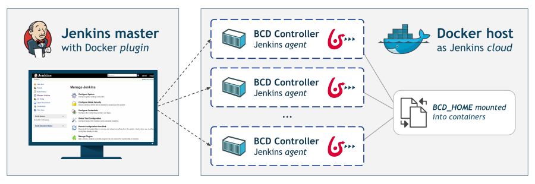
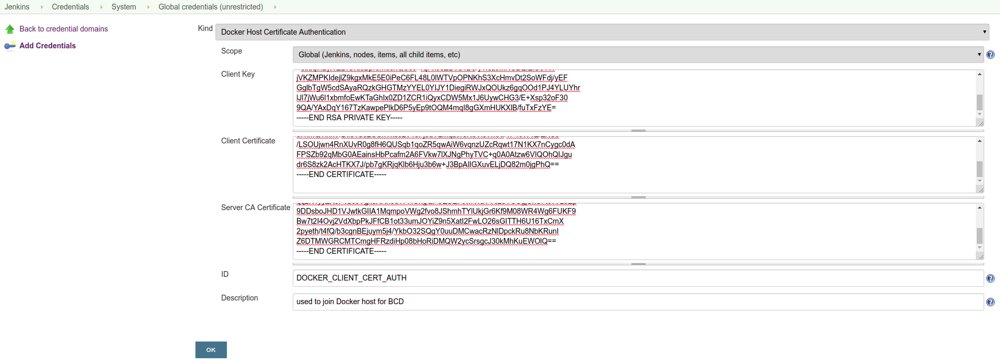
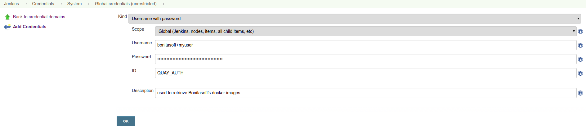
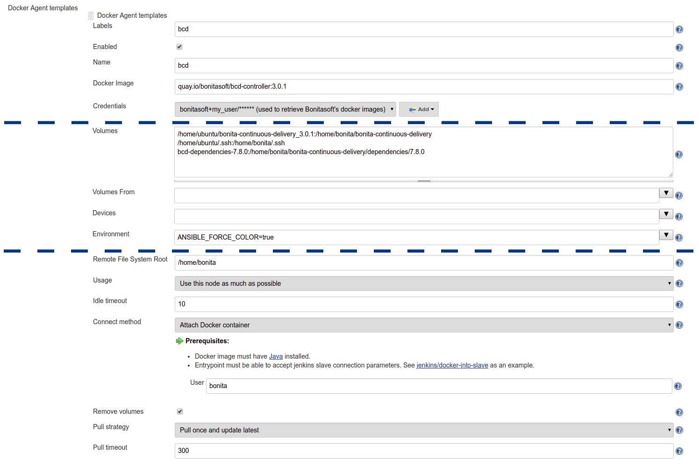

# How to integrate BCD with Jenkins

The BCD controller can not only be run interactively, but also within standard Continuous Delivery servers such as [Jenkins automation server](https://jenkins.io/).

This page describes 2 approaches to using BCD with Jenkins:
- First, a tutorial shows how to set up an **existing Jenkins** platform to start using BCD.
- Second, a **standalone example** lets you start a pre-configured Jenkins server with a BCD-aware Jenkins slave and ready-to-use Jenkins jobs.


## Integration tutorial

There are different ways to run BCD jobs with an existing Jenkins server.  
Here is one recommended setup that requires a Docker host and little changes to your existing Jenkins instance.  
With this setup, the Jenkins master, thanks to the [Jenkins Docker plugin](https://plugins.jenkins.io/docker-plugin), uses the **Docker host** to dynamically provision build agents. On the other hand, the Docker host needs to have the BCD controller image loaded and the `BCD_HOME` directory mounted.



::: warning
This tutorial assumes you are already running a [Jenkins 2](https://jenkins.io/2.0/) instance and that you are familiar with Jenkins system administration.
:::

### Install Docker host

These steps are to be completed on the Docker host.

#### 1. Install Docker and enable remote access

The Docker host needs to run the Docker engine (Community or Enterprise Edition) and can be installed on any [supported platforms](https://docs.docker.com/install/#supported-platforms).  
Besides, the Docker daemon must be accessible remotely on a TCP socket. The [Docker documentation](https://docs.docker.com/engine/reference/commandline/dockerd/#daemon-socket-option) describes how to enable the TCP socket.  
It is also highly recommended to [protect the Docker daemon socket](https://docs.docker.com/engine/security/https/) by enabling the TLS protocol.

#### 2. Install BCD

BCD must be installed on the Docker host which acts here as a **control host**. The installation procedure is described in the [Getting started](getting_started.md) guide.  
The Docker host should now have:
- the `bonitasoft/bcd-controller` Docker image loaded
- the `bonita-continuous-delivery_<version>` directory present
- optionally, the security files for BCD provisioning (SSH key files, AWS credentials)

### Configure Jenkins master

These steps are to be completed on the Jenkins master.

#### 1. Install Docker client

Follow the [Docker documentation](https://docs.docker.com/install/) to have Docker installed on Jenkins master. Actually only the Docker CLI is required. For example [on Ubuntu](https://docs.docker.com/install/linux/docker-ce/ubuntu/#install-docker-ce-1) you only need to install the `docker-ce-cli` package.

#### 2. Install required plugins

The Jenkins master must have the [Docker plugin](https://plugins.jenkins.io/docker-plugin) installed. The Docker plugin is a "Cloud" implementation that lets you add a new Cloud of type "Docker" on Jenkins master.  
Additionally, it is recommended to use [Pipelines](https://jenkins.io/pipeline/getting-started-pipelines/) while using BCD with Jenkins. You can still use standard Jenkins "freestyle" jobs but pipelines are more designed for continuous delivery. Therefore this requires to install the [Pipeline plugin](https://plugins.jenkins.io/workflow-aggregator) (aka. `workflow-aggregator`).  
This tutorial also provides an example pipeline which requires the [Pipeline Utility Steps](https://plugins.jenkins.io/pipeline-utility-steps), [Pipeline: GitHub Groovy Libraries](https://plugins.jenkins.io/pipeline-github-lib) and [AnsiColor](https://plugins.jenkins.io/ansicolor) plugins to be installed.

::: info
The [Jenkins plugins documentation](https://jenkins.io/doc/book/managing/plugins/#installing-a-plugin) describes different methods for installing plugins on master.
:::

#### 3. Add Docker Host credentials

As recommended previously, the Docker host should have TLS enabled. Therefore, the Docker host credentials must be added to Jenkins master.  
Follow the [Jenkins credentials documentation](https://jenkins.io/doc/book/using/using-credentials/#adding-new-global-credentials) to add new **Docker Host Certificate Authentication** credentials. These credentials are required to declare a secured Docker cloud in the next step.

::: danger
If your Docker TCP socket is not secured, then you can skip this step. But bear in mind that exposing the Docker TCP socket without TLS is really **not safe**.
:::



In addition, you will have to add a new **Username with password** credentials to grant access to **quay.io** Docker registry.



#### 4. Add a new Cloud

This step instructs Jenkins master to add a new _Cloud_ of type Docker in order to provision build agents for BCD jobs.

Follow these steps to add a Docker cloud:
* Edit Jenkins system configuration (**Jenkins > Manage Jenkins > Configure System**) and **Add a new cloud** of type _Docker_.
* Give it a **Name** and a **Docker Host URI** like `tcp://dockerhost:2376` (where `dockerhost` is the hostname or IP of the Docker host).  
  _It is conventional to use port `2376` when TLS is enabled, and port `2375` for un-encrypted communication with the Docker daemon._
* With a secured Docker TCP socket, select the **Server credentials** created previously. Otherwise, select _None_.
* Click on **Test Connection** to confirm your configuration is correct.


#### 5. Add Docker template

A Docker template must be added to define how to start Jenkins build agents as BCD controller containers.

Click on **Add Docker template** to add a Docker template in the Docker cloud and filling in the fields as follows:
* **Labels**: `bcd`
* **Enabled**: `[checked]`
* **Name**: `bcd`
* **Docker Image**: `quay.io/bonitasoft/bcd-controller:3.0.1` (where 3.0.1 is the version of BCD to use)
* **Volumes**:
  ```
  /home/dockeruser/bonita-continuous-delivery_3.0.1:/home/bonita/bonita-continuous-delivery
  /home/dockeruser/.ssh:/home/bonita/.ssh
  bcd-dependencies-7.8.0:/home/bonita/bonita-continuous-delivery/dependencies/7.8.0
  ```
* **Environment**: `ANSIBLE_FORCE_COLOR=true` (this forces colored output in BCD logs)
* **Remote File System Root**: `/home/bonita`
* **Connect method**: `Attach Docker container` - **User**: `bonita`



::: info
Jenkins is now ready to run BCD Pipelines. An example scripted pipeline is provided in the next section.
:::

### Create a Pipeline job

Create a **Pipeline** item with a `BCD_SCENARIO` String parameter which sets the BCD scenario path as an environment variable.  
For instance, the `BCD_SCENARIO` parameter can be set to `scenarios/build_and_deploy.yml`.  
Then here is an example pipeline script that builds a LivingApp repository and deploys its artifacts on an already running Bonita platform:
```groovy
@Library('github.com/bonitasoft/bonita-jenkins-library@1.0.0') _

node('master') {
    stage('Retrieve dependencies') {
        docker.withServer('tcp://dockerhost:2376', 'DOCKER_CLIENT_CERT_AUTH') {
            docker.withRegistry('https://quay.io', 'QUAY_AUTH') {
                docker.image('quay.io/bonitasoft/bcd-dependencies:7.8.0').withRun('-v bcd-dependencies-7.8.0:/dependencies') {
                }
            }
        }
    }
}

node('bcd') {
    ansiColor('xterm') {

        stage('Git Ckeckout') {
            git url: 'https://github.com/bonitasoft/bonita-vacation-management-example',
            branch: 'dev/7.8.0'
        }

        stage('build-bonita-app') {
            bcd args: "livingapp build -p ${WORKSPACE} -e Test"
        }

        def jobBaseName = "${env.JOB_NAME}".split('/').last()

        stage('deploy-bonita-app') {
            def zip_files = findFiles(glob: "target/${jobBaseName}-*.zip")
            def bconf_files = findFiles(glob: "target/${jobBaseName}-*.bconf")
            if (bconf_files != null && bconf_files.length > 0)
                bcd args: "livingapp deploy -p ${WORKSPACE}/${zip_files[0].path} -c ${WORKSPACE}/${bconf_files[0].path}"
            else
                bcd args: "livingapp deploy -p ${WORKSPACE}/${zip_files[0].path}"
        }

        stage('archive-artifacts') {
            archiveArtifacts artifacts: "target/${jobBaseName}/**/*.*, target/${jobBaseName}-*.*, .bcd_configurations/*.yml", fingerprint: true
        }

    }
}
```

This pipeline uses a Jenkins shared library [hosted on GitHub](https://github.com/bonitasoft/bonita-jenkins-library).  
This scripted pipeline can also be used in a [Jenkinsfile](https://jenkins.io/doc/book/pipeline/jenkinsfile/) and it can be checked into your LivingApp repository.


## Standalone example

The `bonita-continuous-delivery_<version>.zip` archive also provides a `jenkins-example` directory which contains a minimal working example of a Continuous Delivery platform with Jenkins and BCD. This example will start a pre-configured Jenkins server with a BCD-aware Jenkins slave and ready-to-use Jenkins jobs.  

It is provided as a [Docker Compose](https://docs.docker.com/compose/) project.

Therefore you should have **Docker and Docker Compose** installed on the target host to run this example.

This example is provided with Compose file version 3.2 which requires Docker Compose 1.12.0+ and Docker Engine 17.04.0+. Refer to [Compose and Docker compatibility matrix](https://docs.docker.com/compose/compose-file/#compose-and-docker-compatibility-matrix) and [Compose release notes](https://docs.docker.com/release-notes/docker-compose/) for further details.

::: info
In this example, a Jenkins slave is created from a Docker image which extends the BCD Controller image. Then an example job is defined as a [Jenkins Pipeline](https://jenkins.io/doc/book/pipeline/) job in which `bcd` commands are invoked.  
This allows you to easily re-use parts of this example in your own Jenkins instance.
:::

### Step-by-step run guide

Here is a step-by-step guide to run this example.  
The following commands are to be executed on the target host where Jenkins is to be installed.

1.  Configure the Docker Compose project.
    *   Rename the `docker-compose.override.yml.EXAMPLE` file to `docker-compose.override.yml` (remove the `.EXAMPLE` extension).
    *   Configure `environment` and `volumes` sections and save.
2.  Configure initial secrets used by Jenkins and BCD.
    *   Rename the `secrets/*Password.EXAMPLE` files to `secrets/*Password` (remove the `.EXAMPLE` extension).  
        With most Linux distributions, you can do this with the `rename` command line tool as follows: `rename 's/.EXAMPLE//' *.EXAMPLE`).
    *   Configure each `*Password` file with appropriate credentials.
3.  Make sure the BCD Controller Docker image is loaded as described in the installation section of the [BCD controller Docker image](bcd_controller.md) page.
4.  Create and start containers with Docker Compose.
    ```bash
    $ cd jenkins_example
    $ docker-compose up -d
    ```

::: warning
**Important Note**: Ensure volumes configured are correctly mapped to existing files or folder on the host, otherwise the docker daemon will create empty folders at the configured location (default docker behavior for volumes).
As an example, if you declare a volume mapping in your `docker-compose.override.yml` file for the file `secrets/bonitaPassword` and you forget to create the corresponding file in the `secrets` folder, you will end up with a folder named `bonitaPassword` after the first docker-compose run.
:::

As a result Jenkins is up and running on port `9090` of the target host.  
You can now log-in to Jenkins using one of the pre-configured users:

*   `admin` - User with administration rights. Password has been initialized with `secrets/adminPassword`.
*   `bonita` - User with limited rights. Password has been initialized with `secrets/bonitaPassword`.

::: warning
**Important Note**: Prepare your BCD scenario and dependencies as usual before using the pre-configured Jenkins jobs.
:::

### Pre-configured Jenkins jobs

Once authenticated to Jenkins you can now launch pre-configured jobs.  
This example project provides the following jobs:

*   `bcd-pipeline` - this job shows how the BCD CLI can be used to build a Continuous Delivery pipeline for a Bonita Living Application.
*   `bcd-undeploy` - this job allows to undeploy a Bonita stack (by removing Docker containers) and if needed it can also destroy AWS EC2 machines when using BCD with AWS cloud provider.
